# Portable Executable 

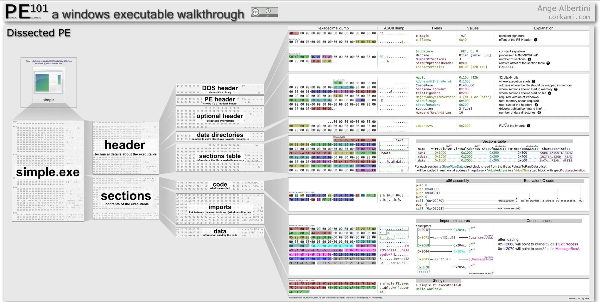

You can use any executable to deep dive into OS internals. Here I have used Microsoft's notepad.exe and to debug this I have used Microsoft's debugger called windbg. 
When we execute an .exe file, the Windows OS Loader reads its PE structure to get the information needed to map the file from the hard drive into memory. Here we are going to understand PE structure, the concepts and various data directories inside it. 

Fist, open the windbg. Open up the executable (notepad.exe in this case) in windbg.
File -> Open Executable

Once opened. We can list of all loaded modules using command. Take a look at the following output: **`lm`**

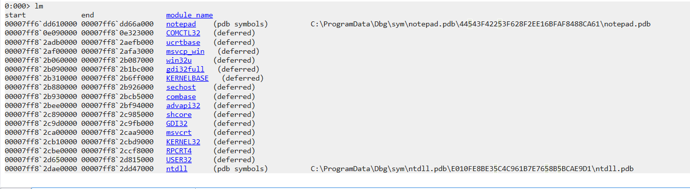

We can see all the DLLs loader with a range of addresses. Also, you can click into module name to see its infomation.


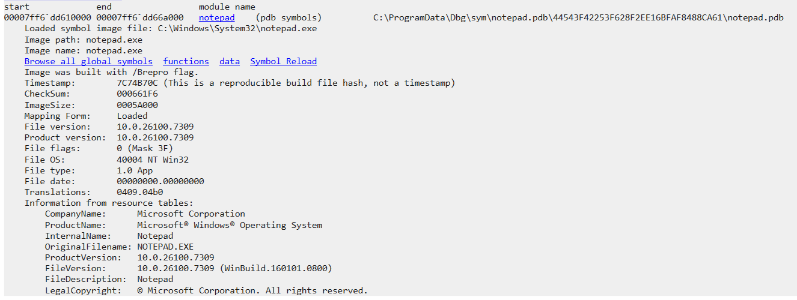

## The headers of a PE file include:

* MS-DOS header : The DOS header is a 64-byte structure that allows the PE file to be MS-DOS compatible.
* MS-DOS stub : Although PE files are backward compatible for historical reasons, modern Windows PE files aren’t intended to run in DOS. The DOS stub defines an error message that prints when a user attempts to run a modern PE file in DOS. The default is “This program cannot be run in DOS mode.”
* Rich Header : Used in executables developed using Microsoft IDEs, the rich header can be used to identify build information. It can be used by malware developers and analysts in a variety of interesting ways.
* NT Headers
  * PE Signature: A DWORD (4-bytes) that identifies the file as a PE image. It always has the value 0x50450000, or ASCII ‘PE\0\0’.
  * File Header: A struct with 7 elements that contains important information about the PE file. This includes the size of the section table, the size of the optional header, machine architecture, time-date stamp, and characteristics of the PE file.
  * Optional Header: The most important part of the NT Headers. It contains a lot of information critical to the execution of the PE file, including the data directories.
    * Data Directories: An array containing 16 directories with important information used by the PE loader.
* Section Table / Section Headers: The Section Table contains one Section Header per row. Each Section Header contains important information about the PE file sections.

## The sections of a PE file include:

.text
.rdata
.data
.pdata
.idata
.bss
.reloc
.rsrc

## DOS header
Every PE begins with a DOS header having the structure of type _IMAGE_DOS_HEADER. This occupies the first 64 bytes of the PE file. To inspect the DOS Header, we use the **`dt`** (Display Type) command. This command is an "X-ray" tool that applies a known structure template to a specific memory address, allowing us to see the organized fields instead of raw hex bytes.

```windbg
dt _IMAGE_DOS_HEADER <base_address>
```
For example: dt _IMAGE_DOS_HEADER 00007ff6`dd610000 (find this address on lm command)

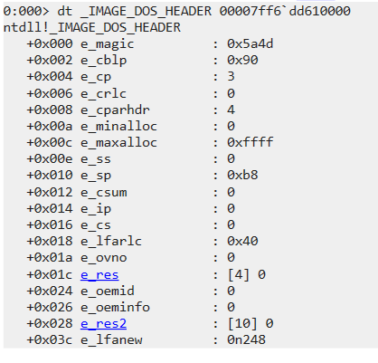

This output reveals two critical pieces of information for the OS Loader:

* e_magic: The "Magic Number" of the file, always set to 0x5a4d (the ASCII characters MZ). This signature confirms the file is a valid executable.

* e_lfanew: A 4-byte offset located at the end of the DOS header. This value points to the beginning of the NT Headers . In WinDbg, we add this offset to the Base Address to find where the real PE structure begins.

Most fields in _IMAGE_DOS_HEADER are legacy artifacts from the MS-DOS era. In modern Windows forensics, we focus primarily on e_magic (to verify the MZ signature) and e_lfanew (the offset to the NT Headers). In this case, e_lfanew is 248, meaning the real PE header starts 248 bytes after the base address.

### Important: Base Address vs. Actual Header Address

In WinDbg, the `dt` command will force-map any memory address to the structure you specify. It is crucial to provide the **exact offset** to get valid data. 

Compare these two results from my analysis:

#### Incorrect: Mapping File Header at Base Address
If we apply `_IMAGE_FILE_HEADER` directly to the **Base Address**, WinDbg incorrectly interprets the DOS Header as a File Header.
- **Result**: `Machine` shows `0x5a4d` (which is actually the `MZ` signature from the DOS Header). This is "garbage" data because the offsets do not align.
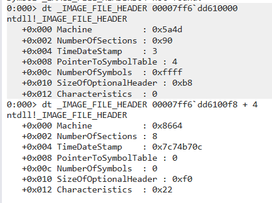
#### ✅ Correct: Mapping File Header at NT_Header + 4
By adding the `e_lfanew` offset (`0xf8`) and the 4-byte Signature, we reach the real File Header.
- **Machine**: `0x8664` (Confirmed x64 architecture).
- **NumberOfSections**: `8` (A valid count for modern `notepad.exe`).
- **SizeOfOptionalHeader**: `0xf0` (Standard size for 64-bit optional headers).


## RICH header

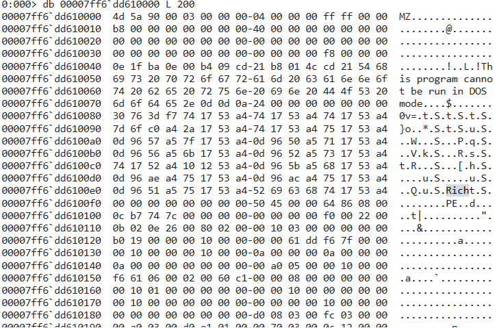

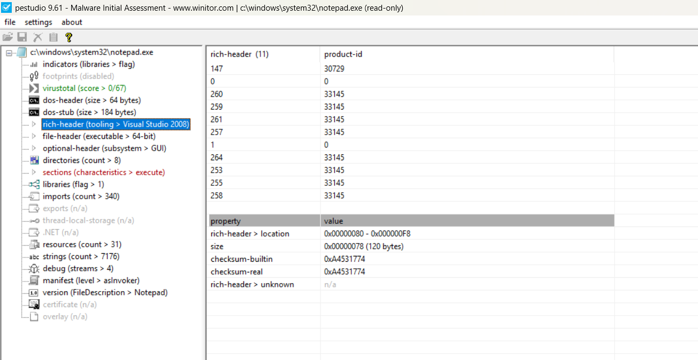

The **Rich Header** is an undocumented data structure found only in executables compiled with Microsoft Visual Studio (MSVC). It is located in the "no-man's land" between the **DOS Stub** and the **NT Headers**.

### Anatomy and Mechanism
Unlike other headers, the Rich Header is encoded to prevent simple string searching. 
* **The "Rich" Signature**: The end of the structure is marked by the ASCII string `Rich` (`0x68636952`).
* **XOR Encoding**: The 4 bytes immediately following the "Rich" signature serve as an **XOR Key**. To read the header's content, all preceding data must be XORed with this key.
* **The "DanS" Signature**: After decoding, the beginning of the structure is marked by the string `DanS`.

## NT header

Next, het to the NT header by followwing command:
**`dt _IMAGE_NT_HEADERS64 <basse_address + e_lfanew> `**

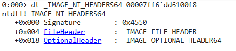

- PE Signature 
  
    The first 4 bytes of the NT Headers are the Signature.

    Value: 0x4550

    ASCII: PE\0\0

    Function: It serves as a definitive "stamp of approval" that this file is a valid Portable Executable for Windows NT systems.

### File Header

**`dt _IMAGE_FILE_HEADER <NT header address> +4`**

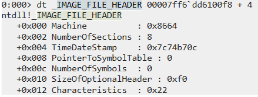


### Optional Header


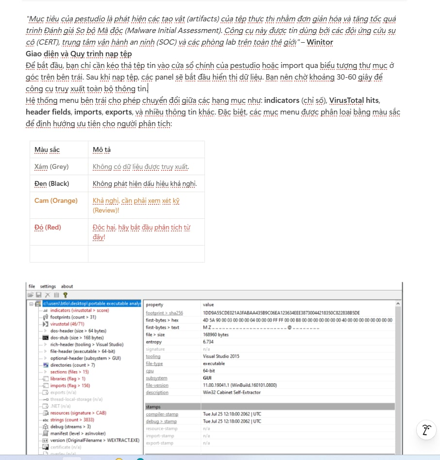

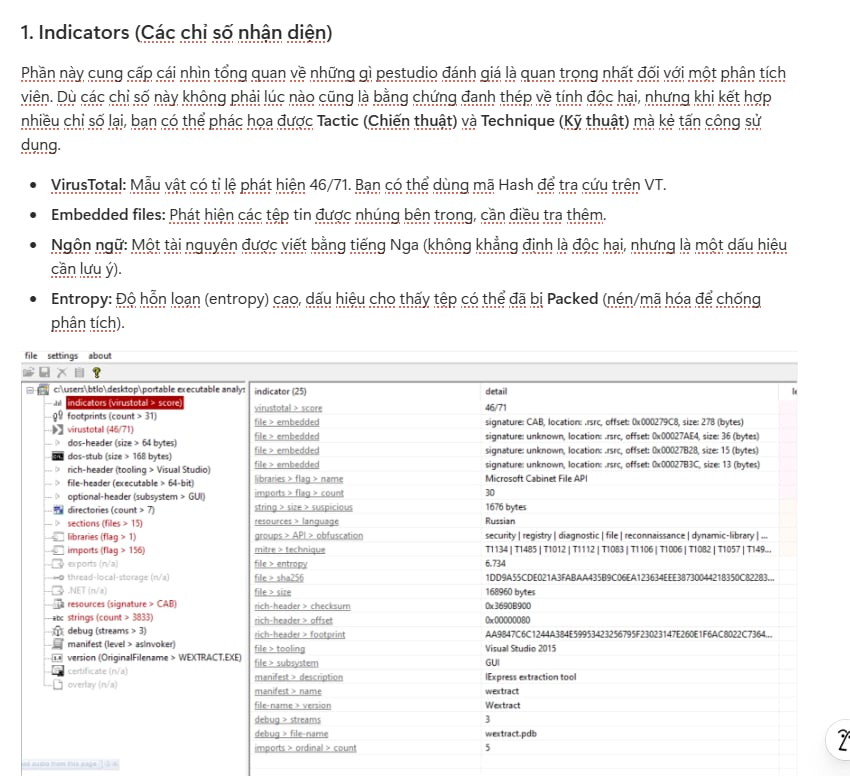

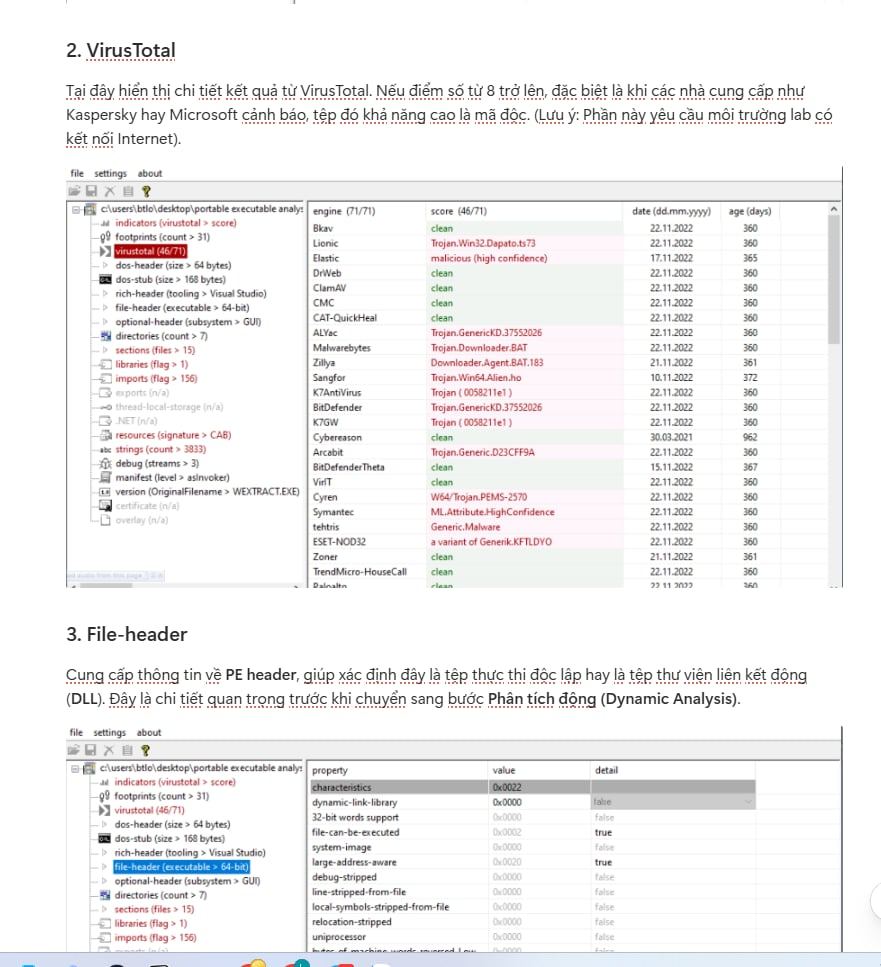

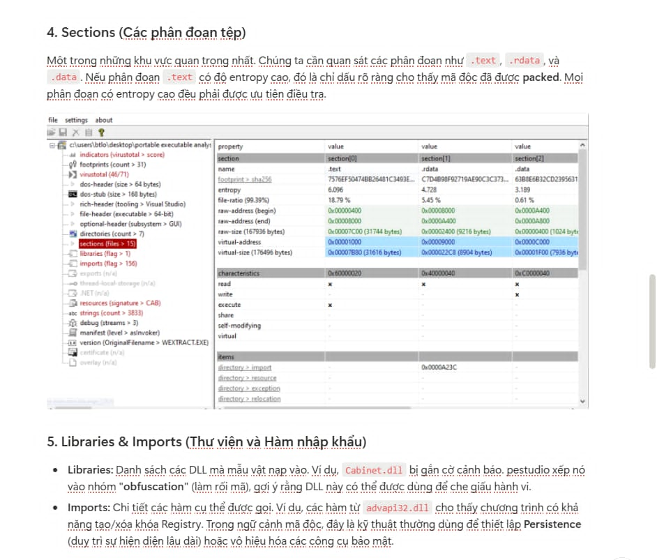

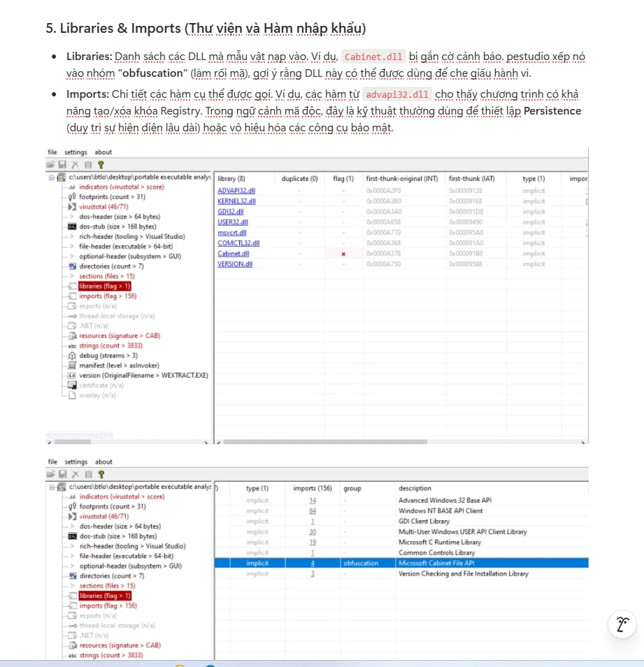

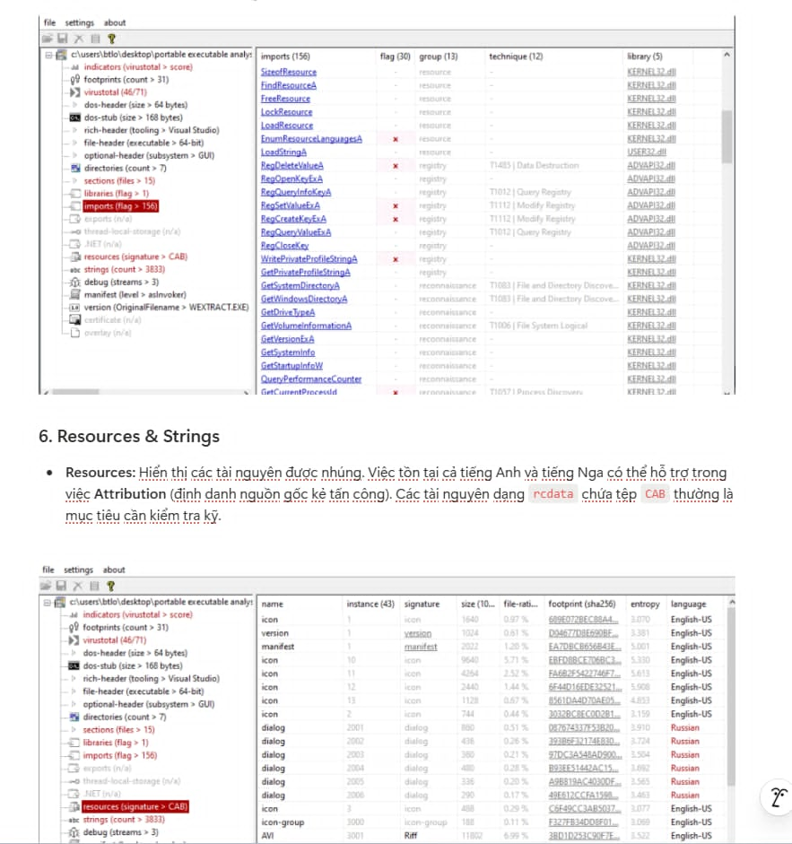

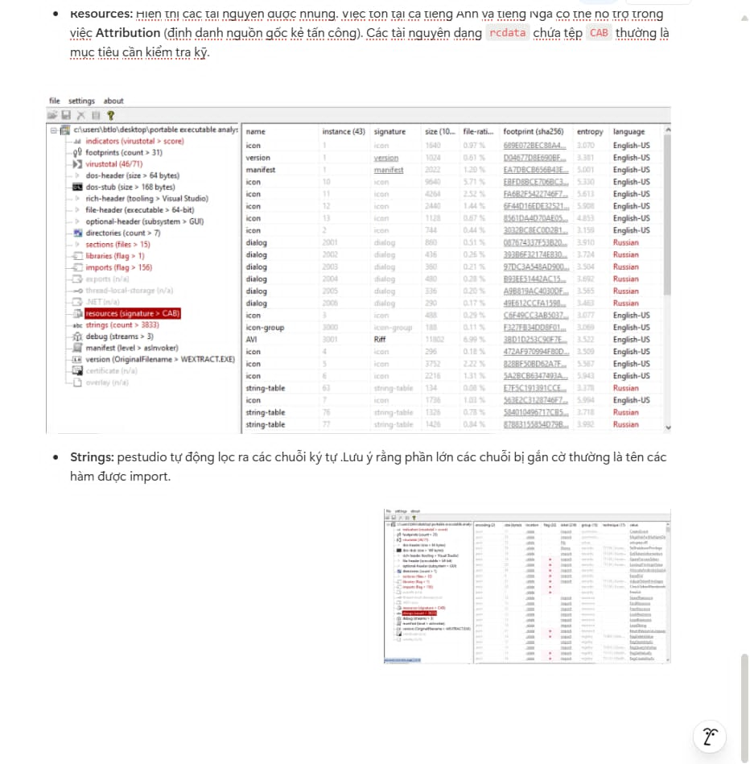

