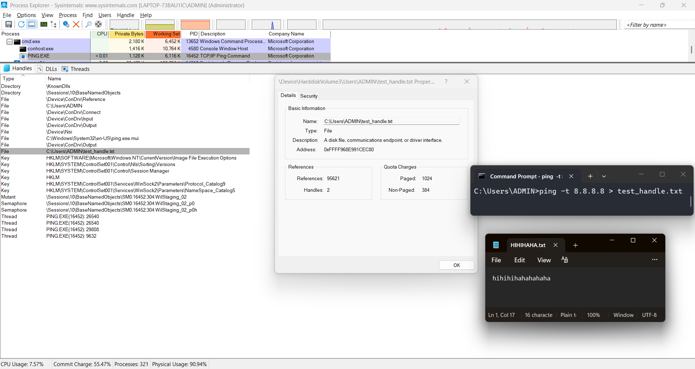

# Tổng hợp Kiến thức Chi tiết: Kiến trúc Windows Kernel & Executive Objects

## 1. Kiến trúc Tổng thể: User Mode và Kernel Mode
Để bảo vệ hệ thống khỏi sự cố và mã độc, bộ vi xử lý (CPU) và Windows chia bộ nhớ thành hai không gian hoạt động với các mức đặc quyền (Ring) khác nhau:

- **User Mode (Chế độ người dùng - Ring 3):** Mức đặc quyền thấp nhất. Đây là nơi các ứng dụng phần mềm (Chrome, Word, Game, và cả mã độc thông thường) hoạt động. Các tiến trình ở đây bị cô lập với nhau. Nếu một ứng dụng bị lỗi (crash), nó chỉ làm chết chính nó chứ không làm sập hệ thống. Ứng dụng ở User Mode **không thể** chạm trực tiếp vào phần cứng hay đọc bộ nhớ của ứng dụng khác; chúng phải "nhờ vả" Kernel thông qua các hàm API (System Calls).
- **Kernel Mode (Chế độ nhân - Ring 0):** Mức đặc quyền cao nhất, nơi hệ điều hành cốt lõi và các trình điều khiển (drivers) phần cứng hoạt động. Bất kỳ một lỗi nhỏ nào ở đây (như rò rỉ bộ nhớ, truy cập sai địa chỉ) cũng sẽ khiến toàn bộ hệ thống sụp đổ ngay lập tức (hiện tượng Màn hình xanh chết chóc - BSOD).

## 2. Đi sâu vào Kernel Mode (Nhân Windows)
Kernel Mode không phải là một khối duy nhất mà được chia thành nhiều tầng (layers) phối hợp nhịp nhàng:

1. **HAL (Hardware Abstraction Layer - `hal.dll`):** Tầng thấp nhất, giao tiếp trực tiếp với CPU và bo mạch chủ. Nó "che giấu" sự khác biệt giữa các loại phần cứng (Intel, AMD, ARM) để phần còn lại của Windows chỉ cần nói một ngôn ngữ chung.
2. **Microkernel (Nhân vi mô - Phần dưới của `ntoskrnl.exe`):** Chịu trách nhiệm cho các tác vụ gốc rễ nhất: lập lịch cho các luồng (Thread scheduling) chạy trên các nhân CPU, và xử lý các ngắt phần cứng (Interrupts).
3. **Windows Executive (Tầng Thực thi - Phần trên của `ntoskrnl.exe`):** Đây là "bộ sậu quản lý" quyền lực nhất của Windows, bao gồm nhiều hệ thống con (Subsystems/Managers). **Đây chính là nơi sinh ra khái niệm "Executive Objects"!**
   - *Object Manager (Trình quản lý Đối tượng):* Quản lý vòng đời tài nguyên.
   - *Memory Manager:* Quản lý RAM và bộ nhớ ảo.
   - *Process/Thread Manager:* Quản lý việc tạo/xóa tiến trình và luồng.
   - *I/O Manager:* Quản lý giao tiếp với thiết bị, tệp tin, mạng.
   - *Security Reference Monitor (SRM):* "Cảnh sát" kiểm tra quyền truy cập (Access Control).
4. **Kernel-Mode Drivers (`.sys`):** Các trình điều khiển thiết bị (bàn phím, card mạng, ổ cứng) và các driver của phần mềm diệt virus/EDR. (Ví dụ: `tcpip.sys`).
5. **Windowing and Graphics (`win32k.sys`):** Quản lý giao diện đồ họa (GUI), cửa sổ (WindowStation/Desktop).

## 3. Khái niệm Cơ bản: Cấu trúc vs Đối tượng Thực thi (Executive Object)
- **Cấu trúc C (C Structure):** Một khối RAM chứa dữ liệu thuần túy (VD: gói tin TCP/IP tạm thời do `tcpip.sys` tạo). Không được hệ thống theo dõi tập trung.
- **Đối tượng Thực thi (Executive Object):** Là các cấu trúc dữ liệu quan trọng **thuộc về tầng Windows Executive**. Chúng được cấp phát và quản lý chặt chẽ bởi Trình quản lý Đối tượng (Object Manager).
- **Điểm phân biệt:** Mỗi Executive Object luôn được Object Manager "dán" thêm một cái tem gọi là `_OBJECT_HEADER` ngay trước khối dữ liệu. Header này chứa: Tên đối tượng, Phân quyền bảo mật (Security Descriptor liên kết với SRM), và Số đếm tham chiếu (Reference Count).

## 4. Trình Quản lý Đối tượng (Object Manager) hoạt động ra sao?
Bởi vì nằm trong tầng Executive quyền lực, Object Manager kiểm soát mọi tài nguyên thông qua 3 tác vụ chính:
- **Tạo (Create):** Cấp phát vùng nhớ, dán `_OBJECT_HEADER` để biến một cấu trúc thành Executive Object.
- **Bảo vệ (Protect):** Khi ứng dụng (User Mode) muốn dùng đối tượng, nó gọi System Call. SRM và Object Manager sẽ kiểm tra quyền (ACL) trước khi cấp một "Thẻ xử lý" (Handle).
- **Xóa (Delete):** Dùng cơ chế đếm tham chiếu. Khi không còn Handle nào trỏ đến đối tượng (Reference Count = 0), nó bị xóa khỏi RAM.

## 5. Bản chất Tiến trình (`_EPROCESS`) trong bối cảnh Kernel
- "Mọi thứ cần quản lý đều là Object" để dễ dàng kiểm soát tập trung. Do đó, Tiến trình (`_EPROCESS`) cũng là một Đối tượng Thực thi do Process Manager tạo ra và Object Manager quản lý.
- **`_EPROCESS` là một "Cái hộp chứa" (Container):** Nó không tự chạy lệnh. Nó chứa:
  - **Không gian địa chỉ ảo** (Do Memory Manager cấp).
  - **Luồng `_ETHREAD`** (Do Microkernel lập lịch chạy trên CPU).
  - **Thẻ bảo mật `_TOKEN`** (Định danh người dùng).
  - **Bảng Handle (Handle Table):** Chứa các thẻ xử lý trỏ ra các Executive Object khác.

## 6. Các Đối tượng Thực thi Phổ biến (Góc nhìn Pháp y Bộ nhớ)
| Tên Đối tượng | Cấu trúc C | Chức năng chính |
| :--- | :--- | :--- |
| **File** | `_FILE_OBJECT` | Đại diện cho tệp/thư mục đang mở. |
| **Process** | `_EPROCESS` | Bộ chứa tiến trình, ranh giới an toàn cho luồng và bộ nhớ. |
| **Thread** | `_ETHREAD` | Thực thể thực thi lệnh CPU được lập lịch. |
| **Token** | `_TOKEN` | Chứa ngữ cảnh bảo mật (SID, Privileges). |
| **Mutant** | `_KMUTANT` | Cơ chế loại trừ tương hỗ (Mutex), dùng để đồng bộ hóa. |
| **Key** | `_CM_KEY_BODY` | Đại diện cho một khóa Registry đang được mở. |
| **Driver** | `_DRIVER_OBJECT` | Driver chạy ở Kernel-mode (`.sys`) đã nạp vào bộ nhớ. |

## 7. Các Công cụ Khám phá & Ứng dụng Pháp y (DFIR)
- **WinObj (Sysinternals):** Công cụ User-mode hiển thị cấu trúc cây của Object Manager (Dựa trên thông tin từ `_OBJECT_HEADER`).
- **Process Explorer (Sysinternals):** Xem bảng Handle của một `_EPROCESS` cụ thể để biết tiến trình đó đang nắm giữ tài nguyên gì.
- **Volatility (Memory Forensics):** Phân tích file RAM dump. Các plugin như `windows.pslist` và `windows.handles` quét trực tiếp các cấu trúc Executive Objects tàng hình trong Kernel memory để dựng lại hiện trường hệ thống.
- **WinDbg:** Trình gỡ lỗi nhân. Cung cấp góc nhìn "đáy" của Kernel Mode, cho phép đọc từng byte mã hex của các cấu trúc (VD: lệnh `dt nt!_EPROCESS`).

## ví dụ:
#### đầu tiên có 1 tiến trình .exe đi thì nó chỉ nằm trên ổ cứng dưới dạng 0110...

#### thằng objectmanager k quan tâm nó là j 

#### khi chạy .exe đó thì trong thằng exe là một trình tự thông tin phần cứng viết theo cấu trúc PE là đọc theo đó sẽ biết cái .exe gồm cgi bộ nhớ bắt đầu từ đâu dung lượng bao nhiêu ...

#### thì cái thằng loader với memmory manager nó tạo bảng mapping trên thanh ram tới địa chỉ gốc chạy tới đâu nó sẽ load tới đó

#### loader sẽ bảo object manager tạo 1 tiến trình cấp object header để bắt đầu ánh xạ từ ổ cứng vô tạo ra các ethread

#### xong r lúc chạy thì mấy thằng ethread trong .exe xin object manager quyền truy cập vô mấy cái cần thiết

